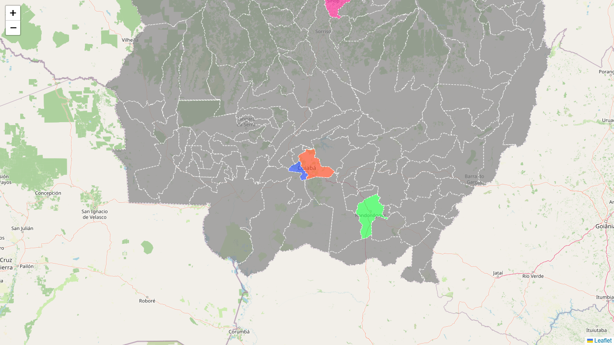

# Mapa Interativo dos Municípios do Mato Grosso

Aplicação React com **Leaflet** para exibir um mapa interativo do estado do **Mato Grosso**, com municípios coloridos individualmente e tooltip com o nome da cidade ao passar o mouse.



---

## Tecnologias

- [React](https://reactjs.org/)
- [React Leaflet](https://react-leaflet.js.org/)
- [Leaflet](https://leafletjs.com/)
- GeoJSON (limites municipais do MT)
- CSS customizado para tooltips

---

## Funcionalidades

- Mapa centralizado no Mato Grosso com zoom ajustado
- Municípios destacados com cores personalizadas (Cuiabá, Rondonópolis, Várzea Grande, Sinop e outras cidades)
- Tooltip interativo com o nome do município
- Camada base do OpenStreetMap com controles de zoom

---

## Como executar

### 1. Clone o repositório

```bash
git clone https://github.com/LayMatos/Mapa-Mato_Grosso.git
cd Mapa-Mato_Grosso
```

### 2. Instale as dependências

```bash
npm install
```

### 3. Inicie o servidor de desenvolvimento

```bash
npm start
```

Acesse [http://localhost:3000](http://localhost:3000) no navegador.

### Build para produção

```bash
npm run build
```

---

## Estrutura de arquivos

```
Mapa-Mato_Grosso/
├── docs/
│   └── screenshot.png
├── public/
│   └── index.html
├── src/
│   ├── App.js
│   ├── App.css
│   ├── AppExp1.js
│   ├── index.js
│   ├── index.css
│   ├── mato-grosso-geojson.json
│   ├── reportWebVitals.js
│   └── setupTests.js
├── package.json
└── README.md
```

---

## Sobre o GeoJSON

O arquivo `src/mato-grosso-geojson.json` contém os limites dos municípios do estado de Mato Grosso. Cada feature deve ter a propriedade `feature.properties.name` com o nome da cidade.

---

## Cores personalizadas

As cores dos municípios podem ser alteradas na função `getColor` em `src/App.js`:

```javascript
const colors = {
  "Cuiabá": "#FF5733",
  "Rondonópolis": "#33FF57",
  "Várzea Grande": "#3357FF",
  "Sinop": "#FF33A1",
  // Adicione mais cidades aqui
};
```

---

## Dependências principais

```bash
npm install react react-dom react-leaflet leaflet react-scripts
```

O CSS do Leaflet já é importado em `src/App.js`:

```javascript
import 'leaflet/dist/leaflet.css';
```

---

## Licença

Este projeto está sob a licença MIT.

---

## Autora

Feito com 💙 por **Layssa Matos**
